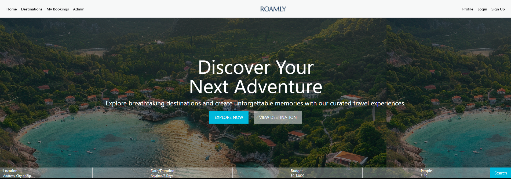

# Roamly — Travel Booking Platform

> Explore destinations, manage packages, and book trips — all in one place.

[](https://roamly-destinations.vercel.app/)
[](https://nextjs.org/)
[](https://www.mongodb.com/atlas)
[](./LICENSE)

---

## About

**Roamly** is a full-stack travel booking web application built with **Next.js 15 App Router** and **MongoDB**. Users can explore curated travel destinations, view detailed package pages, and manage their bookings — all through a fast, modern interface secured with Google OAuth and JWT.

Whether you're a traveler hunting for the next adventure or a developer looking for a real-world full-stack Next.js reference, Roamly has you covered.

---

## Screenshots

| Home Page | Dashboard |
|-----------|-----------|
| 

>  **Demo walkthrough:**
> 

---

## Live Demo

 **[roamly-lake.vercel.app](https://roamly-destinations.vercel.app/)**

>  Demo credentials are not publicly available at this time. Register a new account or sign in with Google to explore the app.

---

## Features

- ** Authentication** — Email/password signup & login plus Google OAuth, powered by Better Auth with JWT-secured API routes
- ** Destination Management** — Browse, add, edit, and delete travel packages with dynamic detail pages
- ** Booking System** — Book destinations and cancel existing bookings with real-time database updates
- ** User Profile** — Edit profile details with a conditional navbar UI that adapts to authentication state

---

## Tech Stack

| Layer | Technology |
|-------|-----------|
| **Framework** | Next.js 15 (App Router) |
| **Database** | MongoDB + Mongoose |
| **Authentication** | Better Auth + Google OAuth |
| **Authorization** | JWT (jsonwebtoken) |
| **UI Library** | HeroUI |
| **Styling** | Tailwind CSS |
| **Deployment** | Vercel |

---

## Project Structure

```
roamly/
├── app/                  # Next.js App Router pages & API routes
│   ├── (auth)/           # Auth pages (login, register)
│   ├── destinations/     # Destination listing & detail pages
│   ├── dashboard/        # User dashboard & bookings
│   └── api/              # API route handlers
├── components/           # Reusable UI components
├── lib/                  # DB connection, auth config, helpers
├── models/               # Mongoose schemas
└── public/               # Static assets
```

---

## Getting Started

### Prerequisites

- **Node.js** v18 or higher
- **MongoDB URI** — local instance or [MongoDB Atlas](https://www.mongodb.com/atlas)
- **Google OAuth credentials** — from [Google Cloud Console](https://console.cloud.google.com)

### Installation

**1. Clone the repository**

```bash
git clone https://github.com/nahin113/roamly.git
cd roamly
```

**2. Install dependencies**

```bash
npm install
```

**3. Configure environment variables**

Create a `.env` file in the project root:

```env
MONGODB_URI=your_mongodb_connection_string
BETTER_AUTH_SECRET=your_auth_secret_key
BETTER_AUTH_URL=http://localhost:3000
GOOGLE_CLIENT_ID=your_google_client_id
GOOGLE_CLIENT_SECRET=your_google_client_secret
```

| Variable | Description |
|----------|-------------|
| `MONGODB_URI` | MongoDB Atlas or local connection string |
| `BETTER_AUTH_SECRET` | Random secret key for Better Auth sessions |
| `BETTER_AUTH_URL` | Base URL of the app (use `http://localhost:3000` locally) |
| `GOOGLE_CLIENT_ID` | OAuth 2.0 Client ID from Google Cloud Console |
| `GOOGLE_CLIENT_SECRET` | OAuth 2.0 Client Secret from Google Cloud Console |

**4. Run the development server**

```bash
npm run dev
```

Open [http://localhost:3000](http://localhost:3000) in your browser.

---

## Manual Test Cases

| # | Action | Expected Result |
|---|--------|-----------------|
| 1 | Register with email & password | Account created; user redirected to home |
| 2 | Sign in with Google OAuth | User authenticated; navbar shows profile |
| 3 | Browse destinations | All packages listed with names, images, and prices |
| 4 | Click a destination | Dynamic detail page loads with full package info |
| 5 | Book a destination | Booking saved to DB; appears in user dashboard |
| 6 | Cancel a booking | Booking removed from DB; dashboard updates immediately |
| 7 | Edit user profile | Changes saved and reflected in navbar |
| 8 | Access protected route without auth | Redirected to login page |
| 9 | Add a new travel package (admin) | New package appears in destination listing |
| 10 | Edit / delete a package | Changes persist correctly in MongoDB |

---

## Known Limitations

- No payment gateway integration — bookings are confirmed without real transactions
- No email confirmation sent after booking
- Image uploads rely on external URLs; no file upload system yet
- No admin dashboard UI — package management requires direct DB access or API calls
- No pagination on the destinations listing page

---

## Future Improvements

- [ ] Integrate a payment gateway (Stripe or SSLCommerz)
- [ ] Add email notifications for booking confirmations and cancellations
- [ ] Build a dedicated admin dashboard for managing packages and users
- [ ] Add image upload support (Cloudinary or AWS S3)
- [ ] Implement pagination and search/filter on the destinations page
- [ ] Add user reviews and ratings for destinations
- [ ] Improve mobile responsiveness across all pages

---

## Key Dependencies

| Package | Purpose |
|---------|---------|
| `next` | React framework with App Router |
| `react` / `react-dom` | Core UI library |
| `better-auth` | Authentication with Google OAuth |
| `mongoose` | MongoDB object modeling |
| `jsonwebtoken` | JWT route protection |
| `@heroui/react` | UI component library |
| `tailwindcss` | Utility-first CSS styling |

> Check `package.json` for exact versions.

---

## Author

**Nahin Ahmed**

[](https://nahinahmed.vercel.app)
[](https://www.linkedin.com/in/nahinahmed/)
[](https://github.com/nahin113)

---

## License

This project is open source and available under the [MIT License](./LICENSE).
